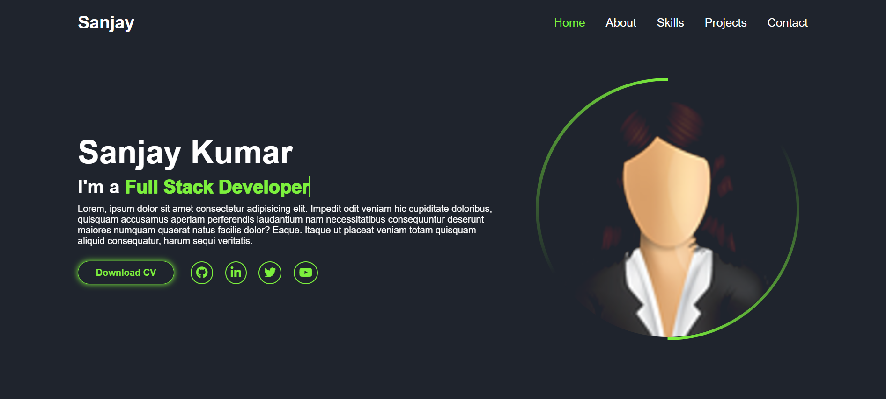
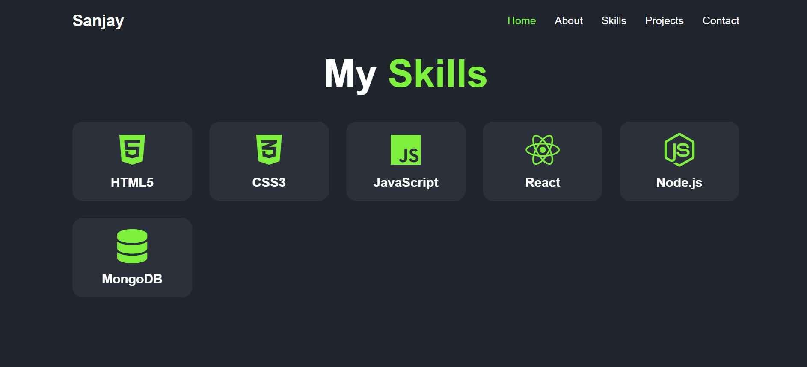
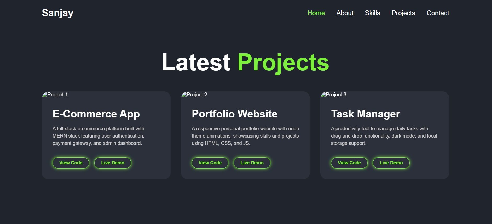
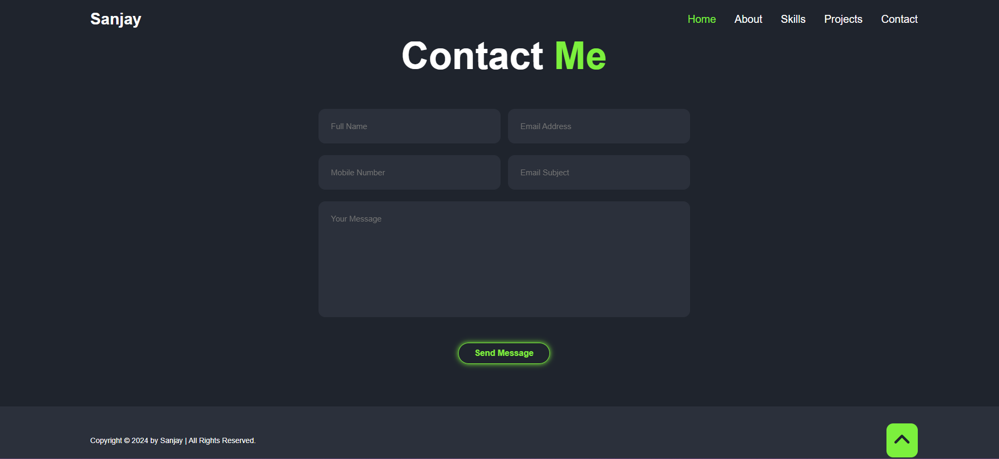

# ⚡ Developer Portfolio

A fully responsive, personal developer portfolio website featuring a dark neon theme, pure CSS animations, and a modern UI. This project showcases skills, projects, and contact information without relying on JavaScript for functionality.

[🔴 **LIVE PREVIEW**](https://skrm05.github.io/developer-portfolio-ui/)

## 📸 UI Screenshots

### Desktop View

> _The landing page with the neon profile animation and typing text._
> 
> 
> 
> 

## 🚀 Features

- **Responsive Design:** Fully adaptable layout for Desktop, Tablet, and Mobile devices.
- **Pure CSS Animations:**
  - Entrance bar animations on page load.
  - Neon glow effects and rotating borders.
  - Typing text effect in the Hero section.
- **No JavaScript Logic:** The mobile navigation menu uses the CSS "Checkbox Hack" instead of JS event listeners.
- **Smooth Scrolling:** Seamless navigation between sections.
- **Interactive Elements:** Hover effects on cards, buttons, and social icons.

---

---

## 🛠 Technologies Used

- **HTML5:** Semantic structure.
- **CSS3:** Flexbox, Grid, Keyframes Animations, Media Queries.
- **FontAwesome:** For icons (Social media, Skills, UI elements).
- **Google Fonts:** "Poppins" font family.

---

## 📦 Installation

Since this is a static website, no backend setup or package installation is required.

1. **Clone the repository:**
   ```bash
   git clone [https://github.com/skrm05/developer-portfolio-ui.git](https://github.com/skrm05/developer-portfolio-ui.git)
   ```
